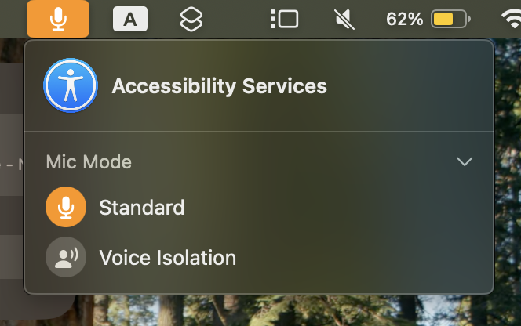

> **UPDATE:** I've found a (temporary) solution to the problem described in this article:
> 1. Open Activity Monitor and choose View &rarr; All Processes.
> 2. Search for `coreaudiod`, and click the Stop icon in the toolbar.
> 3. An alert will appear asking if you really want to kill `coreaudiod`. Choose Quit, and authenticate if asked. `coreaudiod` will immediately restart after you kill it; this is expected.
> 4. AXVisualSupportAgent should immediately stop using the microphone, and won't use it again until your Mac restarts.
>
> You will need to perform these steps again every time you restart your Mac until Apple provides an official fix.

For several months now, "Accessibility Services" has been using my microphone for _something_ non-stop:



Checking in Activity Monitor, this app is located at `/System/Library/PrivateFrameworks/UniversalAccess.framework/Versions/A/Resources/AXVisualSupportAgent.app`.[^1] It seems to be responsible for handling the screen zoom feature of macOS. As far as I'm aware, this thing should have _no reason_ to be using the mic.

Yet, checking the `entitlements.plist` embedded within the executable shows that AXVisualSupportAgnet does indeed have permission to use the mic without user authorization:

```xml
<?xml version="1.0" encoding="UTF-8"?>
<!DOCTYPE plist PUBLIC "-//Apple//DTD PLIST 1.0//EN" "http://www.apple.com/DTDs/PropertyList-1.0.dtd">
<plist version="1.0">
<dict>
  <!-- ... -->
  <key>com.apple.private.tcc.allow</key>
  <array>
    <string>kTCCServiceAccessibility</string>
    <string>kTCCServiceMicrophone</string>
  </array>
  <key>com.apple.security.device.audio-input</key>
  <true/>
  <!-- ... -->
  <key>com.apple.security.temporary-exception.audio-unit-host</key>
  <true/>
</dict>
</plist>
```

So this is, at some level, intentional. But I don't even have any mic-related accessibility features _enabled_, let alone being used. So _why is this thing constantly using my microphone_?

To this day, I still don't have a clue what's going on here. So please, if you have _any_ idea as to what might be going on, [let me know][email] so I can get this goddamn icon out of my menu bar.

------

There's also another issue I'm having with AXVisualSupportAgent that doesn't appear to be related to the one above -- it seems to be leaking memory at a rate of about a megabyte every 20 seconds. I'm even more clueless as to what might be causing this, so again, [please contact me][email] if you have any suggestions.

------

[^1]: The fact that this app is located in the System folder is enough to prove that it isn't malware, because the firmware refuses to boot macOS if the System volume has been modified in _any_ way. You can read more about this [here](https://support.apple.com/guide/security/signed-system-volume-security-secd698747c9/web).

[email]: mailto:cloths-fringe0s@icloud.com
